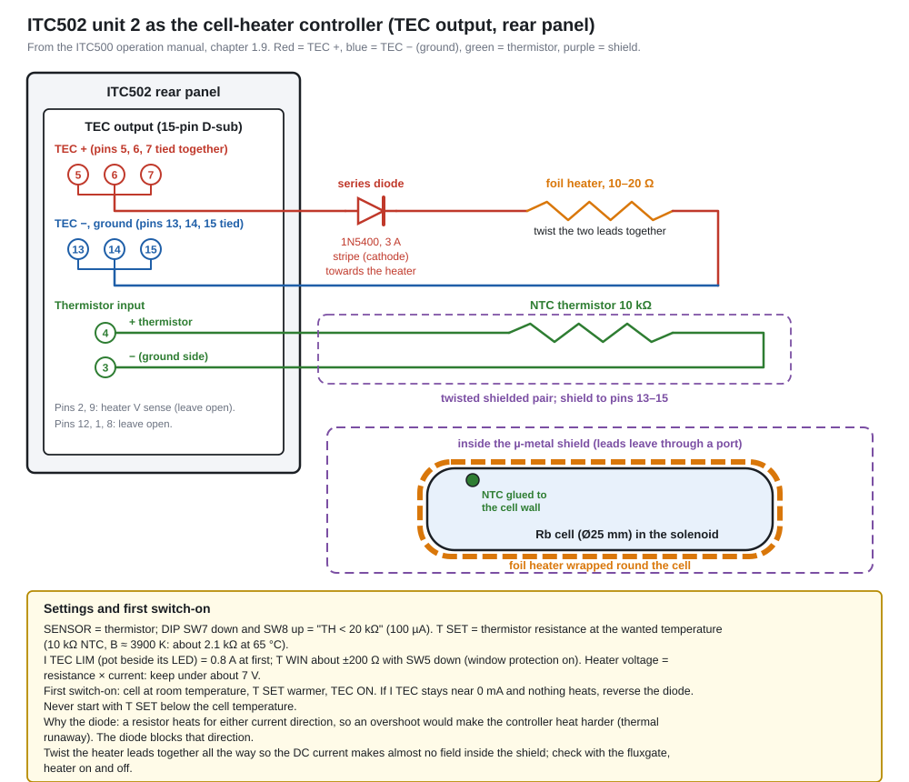
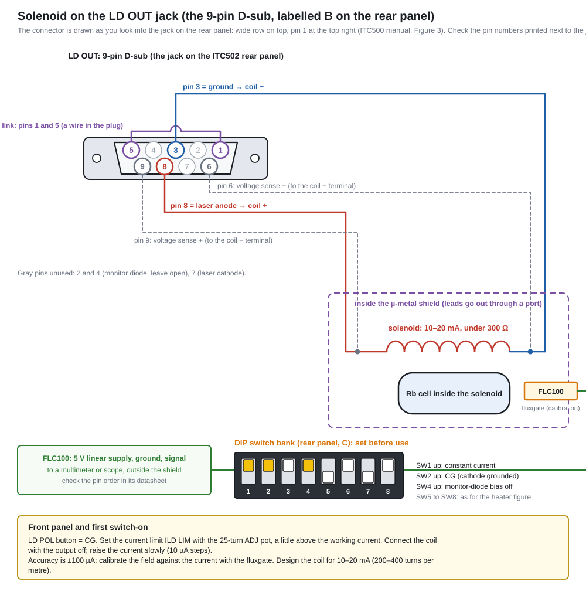

# Questions and answers
Working notes from the project, written 9 Oct 2026. Numbers come from datasheets, the cited papers and this guide's simulator; check them against the vendor documents before ordering or building. No prices on this page. This file is generated from `private/build_qa.py` and mirrors section 09 of the guide.

## The laser

### Q1. Is our 795 nm DFB laser the right specification?

*Added 9 Oct 2026*

**Yes. It is the manufacturer's Rb D1 spectroscopy part** (Toptica Eagleyard EYP-DFB-0795-00015-1500-BFY12-0005, datasheet revision 0.93, 5 Feb 2025). Nothing in the datasheet rules it out.

| Our need | Datasheet | Fit |
|---|---|---|
| Rb-87 D1 line, 794.978 nm | target 794.98 nm reachable at 10–45 °C chip temperature at 15 mW; 0.06 nm/K | yes |
| About 1 mW at the cell | 5–15 mW out of the fibre; 160 mA typical for 15 mW | yes, about 5× margin |
| Linewidth well below about 100 MHz | 0.6 typical, 1.0 MHz at 15 mW | yes |
| Lock range | mode-hop-free over more than 10 GHz; current tuning about 1.4 GHz/mA | yes |
| Single mode | side-mode suppression 30 dB minimum, 45 typical | yes |
| Clean polarization | 20 dB extinction, PM fibre, FC/APC narrow key | yes |
| Protection | built-in micro-isolator (no figure given) plus our fibre isolator | yes |

**What keeps it from perfect**
- Thin current margin: 15 mW needs 160 mA and the absolute maximum is 170 mA. Set the controller limit to 165–170 mA and run near 10–12 mW for lifetime.
- The ITC502 thermistor input reads up to 19.9 kΩ and this thermistor is about 20 kΩ at 10 °C: keep the chip at 15 °C or warmer.
- Toptica Eagleyard lists the part as about to become obsolete (replacement "on request"): consider a spare.
- The datasheet is a preliminary revision (below 1.0), all figures at beginning of life; the individual test protocol that ships with each laser is what counts.
- The label says Class 4 (20 mW, IEC 60825-1).
- Not stated: isolation of the micro-isolator in dB, the fibre type, how the linewidth was measured.

**On arrival check:** the test protocol (wavelength against temperature at 15 mW, operating current, extinction ratio), single-mode operation on the spectrum analyser, that the wavelength lands on the Rb D1 line on the SAS signal, and the fibre key alignment.

Sources: [Eagleyard datasheet](https://global-topticaeagleyard.b-cdn.net/wp-content/uploads/data_sheets/EYP-DFB-0795-00015-1500-BFY12-0005.pdf) · [Steck, Rb-87 D line data](https://steck.us/alkalidata/rubidium87numbers.pdf)

### Q2. What laser power do we actually need?

*Added 9 Oct 2026*

**About 1 mW of control light at the cell and under 1 µW of probe, which means 5–15 mW at the laser fibre.** The 15 mW part is the right size and a 40 mW laser would be wasted.

| Beam | Intensity in the papers | Power needed at the cell |
|---|---|---|
| Control (1/e² radius 2.55 mm) | 1.3–5.5 mW/cm² | 0.13–0.56 mW if that is the peak intensity, 0.27–1.1 mW if it is power over area (the paper does not say) |
| Probe (radius 0.47 mm) | about 0.12 mW/cm² | under 1 µW |
| SAS lock | the simulator gets 0.09 mW on the photodiode | about 0.2–0.5 mW picked off |

More control power only broadens the line: the EIT width grows by about 4.5 kHz per extra mW/cm². The DeRose experiment ran with about 7 mW out of its fibre.

**Where the light goes** (10 mW laser): fibre isolator and connectors ×0.8, 5 % pick-off to the SAS, about 88 % to the control arm, then the double-pass AOM and optics. With realistic AOMs (about 70 % per pass) the control at the cell is about 3 mW, so even a 5 mW laser gives about 1.6 mW. The simulator is pessimistic (35 % per pass): 10 mW gives 0.75 mW and 15 mW gives about 1.1 mW, still enough.

**So:** minimum about 5 mW, comfortable 10–15 mW, not needed 20–40 mW. Measure the double-pass AOM efficiency (the biggest unknown) and the power at the cell with the power meter; turn the control down with the half-wave plate or the AOM RF level if it exceeds about 1 mW.

### Q3. Why not an ECDL?

*Added 9 Oct 2026*

**A DFB is good enough for this experiment and much cheaper and simpler. An ECDL would be a luxury, not a requirement.**

| | DFB (our choice) | ECDL |
|---|---|---|
| Linewidth | 0.6–1 MHz | a few hundred kHz |
| Tuning | mode-hop-free over more than 10 GHz by current and temperature | wide, but piezo and grating alignment |
| Build | one sealed, fibre-pigtailed butterfly with isolator | open cavity, more sensitive to vibration, mode hops |
| Lock actuator | laser current (fast and simple) | piezo plus current feed-forward |
| Cost | the lower one | typically several times more |

**Why a DFB is enough:**
- The papers only ask for a linewidth far below the Doppler width (about 500 MHz), and 1 MHz passes easily.
- The 10 Torr Ne buffer gas makes the optical line wider still (order 100 MHz).
- The narrow 7–26 kHz EIT line depends on the control–probe phase relation, not on the laser's own linewidth; both beams share the laser's noise (my reasoning, not quoted from a paper).
- We need only about 1 mW at the cell.

**When an ECDL would be better:** driver current noise turning into linewidth (1 µA is about 1.4 MHz), scanning several GHz or other lines, a replacement if the DFB is no longer available, or an ECDL already in the building.

### Q4. Why do the reference papers use ECDLs and not DFB lasers?

*Added 9 Oct 2026*

**No sentence in either paper says why, so this is partly inference.** What they do say: ECDLs have a linewidth of a few hundred kHz, DFBs about 1–2 MHz, and either is fine for EIT.

Likely reasons (my judgment):
- **Installed base:** atomic-physics labs have used ECDLs for decades and these groups already own several.
- **Reuse:** an ECDL covers other wavelengths and atoms and scans over several GHz.
- **Narrower line:** more margin for sub-Doppler spectroscopy, not needed for EIT.
- **Wavelength availability:** DFB diodes exactly on the Rb D1 line used to be less common.
- **Teaching setup:** the DeRose paper is an undergraduate set-up where students scan the laser by hand.

None applies strongly to us: one fixed target line, no existing ECDL, and a budget. For a real answer, ask the authors.

### Q5. Is a narrow laser linewidth crucial for EIT?

*Added 9 Oct 2026*

**No, not the laser's own linewidth.** Two different linewidths get mixed up:
- **The EIT linewidth** is the narrow one (7.3 kHz at 1.3 mW/cm², 26 kHz at 5.5 mW/cm²). It is set by control intensity, magnetic field, buffer-gas diffusion and coherence time, not by the laser.
- **The laser linewidth** only has to be well below the optical width of the atoms (Doppler about 500 MHz, wider with buffer gas). Our 0.6–1 MHz is 100× below.

What matters more (my reasoning):
- **Relative phase of control and probe.** Both come from the same laser through phase-locked RF, so the laser's phase noise is common to both and cancels. A 1 m path difference (about 3 ns) at 1 MHz linewidth gives only about 0.02 rad. What reaches the atoms is noise from the RF source and drift in the arm lengths.
- **Lock stability.** The laser must stay within a fraction of the optical width; the DeRose paper reports drift of about 10 MHz per hour and negligible drift during data taking.

A narrower laser helps only with a very noisy driver or sub-Doppler spectroscopy at the few-MHz level; the SAS features are 6–12 MHz wide (the D1 natural width is 5.75 MHz), which a 1–2 MHz laser resolves.

### Q6. What linewidths and frequencies do we have to set?

*Added 9 Oct 2026*

| Item | Value |
|---|---|
| Rb-87 D1 line | 794.978851 nm in vacuum (about 377.107 THz) |
| Control AOM | 80.000 MHz, double pass, so +160.000 MHz |
| Probe AOM | 79.965 MHz, double pass, so +159.930 MHz |
| Control–probe difference | 70 kHz, the ground-state splitting at 50 mG (1.4 kHz per mG) |
| Solenoid field | about 50 mG (the photographed COILS supply showed about 80 mA) |
| Lock dither | about 10–100 kHz on the laser current (the ITC502 modulation covers 0–500 kHz) |
| Excited-state splitting | 814.5 MHz (F′=1 to F′=2) |
| Ground-state splitting | 6.8347 GHz, never needed by the AOMs |
| EIT linewidth target | 30 kHz or narrower, approaching 10 kHz at low power |
| Laser linewidth | 0.6–1.0 MHz (needs only to be below about 100 MHz) |
| SAS feature width | about 6–12 MHz |

Because the offset between the two beams is only kHz, a generator with 1 Hz resolution is far more than precise enough. The control–probe difference must stay steady to well under the EIT width (a few kHz): use one two-channel source, or sources sharing a clock.

## Laser controller

### Q7. Is a DFB with a TEC and laser controller good enough? Which controller?

*Added 9 Oct 2026*

**Yes, if the current noise is low.** The rule: the laser tunes at about 1.4 GHz per mA, so every 1 µA rms of driver noise can become about 1.4 MHz of linewidth.

| Controller | Noise | Verdict |
|---|---|---|
| G&H EM595 | 5 µA rms (10 Hz–10 MHz) | usable, up to about 7 MHz worst case, the noisiest |
| Thorlabs ITC502 | under 1.5 µA rms | about 2 MHz worst case: best match |
| ILX LDX-3220 | not found | current source only, needs a separate TEC controller |
| Thorlabs ITC4001 | not found | no proven advantage |

A 5 µA driver does not harm EIT (the optical line is about 100 MHz wide and both beams share the noise) but it blurs the 6–12 MHz SAS features and makes the lock noisier. Ask vendors for "rms current noise, 10 Hz to 10 MHz" (target about 1 µA or better) and "temperature stability over 24 h"; also check the modulation bandwidth against the lock dither. The laser's temperature tuning is about 28 GHz per kelvin, so the temperature must be stable to a few mK; the lock removes the slow remainder.

### Q8. Is the Thorlabs ITC502 suitable for our laser?

*Added 9 Oct 2026*

**Yes, and it is better than the EM595.**

| Spec | ITC502 | Our laser needs | Verdict |
|---|---|---|---|
| Laser current | 0–200 mA | 160 mA (absolute maximum 170 mA) | fits |
| Compliance voltage | above 6 V | about 2 V | fits |
| Noise (10 Hz–10 MHz) | under 1.5 µA rms | as low as possible | about 2 MHz worst case |
| 24 h drift | under 10 µA (about 14 MHz) | within lock range | fine, the lock removes it |
| Modulation | 0–500 kHz | lock dither 10–100 kHz | fits |
| TEC | ±2 A, 16 W | about 0.4 A | plenty |
| Thermistor | 10 Ω–19.9 kΩ | 10 kΩ NTC | fits, chip at 15 °C or warmer |

**Four things to design for**
- The modulation input is 20 mA/V, about 28 GHz per volt. Put roughly a 100:1 divider (about 1 MΩ in series into the 10 kΩ input) between the lock box and the controller, otherwise lock steps are about 3 MHz and the DAC noise adds linewidth.
- Front-panel steps are coarse (10 µA is about 14 MHz, 1 Ω is about 2 mK or 65 MHz): tune coarsely by hand and let the lock do the fine tuning.
- Set the current limit to 170 mA or below before connecting the laser.
- Check the output polarity (anode ground) and the cable to the butterfly mount.

## Equipment found in the lab

### Q9. Are the extra lab items useful? (second ITC502, LDM-4980 mounts, TCLDM9 mounts)

*Added 9 Oct 2026*

| Item | Useful? | Why |
|---|---|---|
| 2 × ITC502 | yes, both | one drives the laser and its TEC; the second can run a second laser or take over two other jobs (below) |
| 2 × LDM-4980 (14-pin butterfly mount) | yes, likely | ILX's 14-pin telecom mount family fits a 14-pin butterfly like our DFB and can replace the Thorlabs LM14S2; check the pinout first |
| 2 × TCLDM9 | not for the DFB | a mount for 5.6 and 9 mm TO-can diodes, not butterfly packages; useful for a home-built ECDL or a practice diode |
| Cable set label LCM-39425 | unknown | no listing found; read the label |

**Before connecting:** the mounts are ILX wiring (9-pin D-sub, configurable pins; ILX cables are DB9–DB9 for the laser and DB15–DB9 for an ILX temperature controller) and the ITC502 is Thorlabs, so compare the ITC502 laser and TEC pinout with the mount's pin table; the cables may need rewiring. Our laser: anode pin 10, cathode 11, TEC 1 and 14, thermistor 2 and 5, monitor diode 3 and 4.

**Better uses for the second ITC502 (ideas, not bench-tested):** its TEC section (±2 A, 16 W, thermistor input) can drive and regulate the foil heater (needs a 10 kΩ thermistor on the cell), and its laser section (0–200 mA, under 1.5 µA noise) can be a very quiet solenoid supply (1.5 µA is far too small to matter against a 7–26 kHz line); use a resistive coil and check the current limit first.

Sources: [ILX LDM-4984](https://www.newport.com/p/LDM-4984) · [Thorlabs TCLDM9 catalogue](https://www.thorlabs.com/catalogPages/460.pdf)

### Q10. Is the Credix SG-1710 signal generator useful?

*Added 9 Oct 2026*

**Yes, as an AOM driver.** It is a single-channel synthesizer, 200 kHz to 1000 MHz, 1 Hz resolution, 0.5 ppm accuracy, up to +13 dBm, with AM, FM and GPIB (figures from a third-party listing, not a Credix datasheet).
- It can drive one AOM at 80 MHz through an RF amplifier (+13 dBm alone is not enough), for example the AOM in the SAS arm that moves the lock by 160 MHz.
- Two independent generators share no phase, which is acceptable for CW EIT because the offset stays within a few Hz, far below the 7–26 kHz EIT width.
- It is not a gate: switch the RF with a proper RF switch (AM is not a clean off).
- It cannot reach 6.8 GHz.

Source: [SG-1710 listing](https://www.radiolocman.com/op/device.html?di=63870)

### Q11. Can the Aditeg PS-3030DD dual power supply be used as a main supply?

*Added 9 Oct 2026*

**Yes, as the main supply of the RF chain and, if you wish, of the cell heater. Not for the solenoid or the photodiodes.** From the front panel: two adjustable channels with a tracking switch (independent, series, parallel) and a fixed 5 V / 3 A output; the model name suggests 0–30 V and 0–3 A per channel. No datasheet was found, so the ripple is unverified (similar linear supplies quote about 0.5–1 mV rms in voltage mode and about 3 mA rms in current mode).

| Job | Use it? | Why |
|---|---|---|
| RF amplifiers (+24 V) and RF switches (±5 V) | **yes, primary** | channel 1 at +24 V; the fixed 5 V and channel 2 give the two rails; millivolts of ripple do not matter for RF parts; check that the outputs are isolated first |
| Cell heater | yes | constant-current mode, about 0.3–0.5 A, but no temperature loop: add a thermistor and adjust by hand, or let the second ITC502 regulate the heater and keep this supply for the RF parts |
| Solenoid | no | a few mA of ripple is too much against a 7–26 kHz EIT line; use the ITC502 laser section |
| Photodiodes, lock electronics | no | millivolts of ripple |

It is in the lab inventory with a 3D picture.

### Q12. Are the ILX OMM-6810B optical multimeter and the OMH-6745B head useful?

*Added 9 Oct 2026*

**Not with this head. The meter is useful only if a silicon head is found.** The OMM-6810B is ILX's optical power and wavelength meter for the OMH-6700B heads (5-digit LED display, GPIB, no longer sold); its power range, wavelength range and accuracy come from the head.

The head in the lab, the OMH-6745B, reads **950 to 1650 nm** (confirmed from its label), so it cannot measure our 795 nm laser. It is not in the silicon-head brochure I could read, which lists:

| Head | Covers |
|---|---|
| OMH-6703B | power only, 400–1100 nm |
| OMH-6742B | power and wavelength, 350–1100 nm |
| OMH-6790B | 830–1100 nm only (does not cover 795 nm) |

**What a silicon head (OMH-6703B or OMH-6742B) would give:**
- **Power budget:** 100 nW to 1 W, spanning the fibre output (about 5–15 mW), the control (about 1 mW) and the probe (about 2 µW); the integrating sphere makes the reading independent of polarization.
- **Wavelength:** a power/wavelength head reads a power-averaged wavelength to about 1 nm with at least 10 µW. That only confirms the diode is near 795 nm; it cannot find the Rb line or resolve MHz shifts.
- **Cautions:** the detectors are temperature controlled (about one hour of warm-up), accuracy is about 3.5–5 %, the calibration date matters, and the readout is GPIB only.

Until a silicon head turns up, use another power sensor for the power budget. Check whether the lab has other OMH heads.

Source: [ILX 6700B silicon heads brochure](https://www.newport.com/medias/sys_master/images/images/he7/had/9260480790558/6700B-brochure-silicon-REV11.pdf)

### Q13. Can the Thorlabs PM100USB with the S140C and S144C sensors be used?

*Added 10 Oct 2026*

**Yes for the PM100USB and the S140C; no for the S144C.** Figures are from the Thorlabs spec sheets.

| Item | Use? | Why |
|---|---|---|
| PM100USB console | **yes** | reads any C-series head; no display, so it needs a PC with the Thorlabs Optical Power Monitor software |
| S140C (silicon, 350–1100 nm, 1 µW–500 mW) | **yes** | covers 795 nm; reads the fibre output (5–15 mW) and the control (about 1 mW); polarization and beam shape do not matter |
| S144C (InGaAs, 800–1700 nm) | **no** | 795 nm is below its 800 nm limit, so the calibration is not valid; keep it for infrared work |

**Limit:** the S140C floor is 1 µW (1 nW resolution), so the probe at about 2 µW is read poorly. Measure the probe before the attenuating optics, or read it with the lab S120VC (50 nW floor).

### Q14. Which instruments record the result: the power meter or the oscilloscope?

*Added 10 Oct 2026*

**The result comes from a photodetector read on the oscilloscope. The power meter is a setup tool.** The EIT signal is the probe transmission while the two-photon detuning is scanned, and the window is only about 7–30 kHz wide. A USB or benchtop power meter updates far too slowly to follow a scan, shows only a number, and the S140C floor (1 µW) is close to the probe power (about 2 µW).

| Instrument | Job |
|---|---|
| Signal photodetector + oscilloscope | EIT transmission: the result |
| SAS photodiode (+ ITC502) | laser lock signal |
| Power meter (PM100USB + S140C) | fibre, control and AOM-efficiency checks before the run |
| Fabry-Perot or wavemeter | single-mode and mode-hop check (missing from the budget) |
| Fluxgate or gaussmeter | shield and 50 mG field check (missing) |
| Beam profiler or camera, IR card | beam size (sets the intensity) and alignment |
| Fast detector (AD-300/DC) | control and probe beat note, AOM pulse shapes |

### Q15. Is the signal detector the Thorlabs PDA36A2, and how many are needed?

*Added 10 Oct 2026*

**Yes: a Thorlabs PDA36A2, an amplified silicon detector (350–1100 nm, 8 switchable gain steps, 0–70 dB, 3.6 × 3.6 mm chip). Two are needed, a third is optional.**
- One for the probe signal after the Glan-Taylor (the EIT result).
- One for the SAS lock signal.
- Optional third: the control beam monitor or a reference channel. The AD-300/DC we own can serve as a diagnostic channel.

**Gain:** the probe is only about 2 µW, so use about 50–60 dB. At 70 dB the bandwidth falls to a few kHz, which is marginal for a 7–30 kHz window. The SAS detector can use a lower gain. The PDA36A2 normally ships with its ±12 V supply; check before buying a separate LDS12B.

The 3D bench, the Spain-style bench and the equipment table now show the PDA36A2 drawn from the Thorlabs outline drawing (approximate dimensions).

### Q16. Is the Thorlabs PDB210A balanced detector needed?

*Added 10 Oct 2026*

**No, it is overkill.** A balanced detector subtracts the laser intensity noise with a second reference beam. The reference papers do without it:
- Finkelstein et al. 2022: the probe passes a Glan-Taylor and is focused on "a fast photodiode"; the probe is scanned and the EIT spectrum is recorded.
- DeRose et al.: one New Focus 1621 photodiode on a digital oscilloscope (low detector impedance to avoid cable reflections); the pump leakage was reduced with a Glan polariser, not a better detector.

The EIT window is slow (7–30 kHz), so averaging on the oscilloscope recovers any noise. Use the two PDA36A2 detectors. Try balanced detection only if the probe is still too noisy after the Glan-Taylor, scope averaging and a lock-in. The PDB210A datasheet could not be retrieved, so its price and bandwidth are unverified.

Sources: [Finkelstein et al. 2022](https://arxiv.org/abs/2205.10959), [DeRose et al.](https://arxiv.org/abs/2011.09229)

### Q17. Can the Thorlabs PM100USB CAD file be used for the 3D pictures?

*Added 10 Oct 2026*

**Used as a visual reference, not loaded directly.** The SolidWorks part file (.sldprt) is a closed format and cannot be opened here. The Thorlabs web drawing (an eDrawings page) does open in a browser and shows the real shape: a ribbed aluminium extrusion with black end caps, the Thorlabs label on top, the sensor connector at one end and USB at the other. The guide's three.js model of the PM100USB now follows that look, with the S140C head on its cable beside it; the dimensions are estimated from the drawing, not measured.

It appears in the Lab Inventory (item I12), the equipment pictures and the power meter in both 3D benches. To use the exact CAD mesh, export it from SolidWorks as STL or glTF.

### Q18. Is the Thorlabs S120VC head useful?

*Added 10 Oct 2026*

**Yes, and it fills the gap of the S140C.** The S120VC is a silicon photodiode head (200–1100 nm, 50 nW–50 mW, 9.5 mm aperture, 1 nW resolution, uncertainty 3 % from 451 nm). It plugs into the PM100USB like the S140C. Figures are from reseller and catalogue pages (the Thorlabs datasheet was not found; the product is listed as discontinued).

| Head | Range | Use for |
|---|---|---|
| S120VC | 50 nW–50 mW | **probe** (about 2 µW), SAS beams, control (about 1 mW) |
| S140C | 1 µW–500 mW | fibre output (5–15 mW), control; reads independent of beam shape and polarization |
| S144C | 800–1700 nm | not for 795 nm |

With the PM100USB, the S120VC and the S140C the lab has the complete power-meter set. Keep the beam inside the 9.5 mm aperture and enter 795 nm on the console.

### Q19. Is the Newport 818-SL photodiode useful, and does its power meter work?

*Added 10 Oct 2026*

**Maybe, once it has a working Newport meter.** The 818-SL is a passive silicon photodiode head (400–1100 nm, 10.3 mm clear aperture, removable OD3 attenuator that adds three decades of range). It covers 795 nm, but it has no display: a Newport power meter has to read it, and the Thorlabs PM100USB cannot (different connector and calibration). Its power limits depend on the meter and the attenuator, so the exact numbers are in the 818-series datasheet.

**Status in the inventory: check.**
1. Find which Newport meter goes with it, and test whether that meter still works (power on, zero, a known source).
2. Until it works, the Thorlabs PM100USB with the S120VC (probe) and S140C (control, fibre) is the working power-meter set, so nothing is blocked.
3. Without a meter it can still be a photodiode: about 0.5 A/W at 795 nm, so 1 mW gives about 0.5 mA. Check whether the head needs a bias first.

Source: [Newport 818-SL/DB](https://np.d1.mks.com/p/818-SL--DB)

### Q20. Which of the loose mounts and stages in the photographs are useful?

*Added 10 Oct 2026*

Identified from five photographs of the lab shelves and added to the Lab Inventory with a drawing of each (the drawings follow the photographs, with the markings that are legible).

| Item | Status | Use in the bench |
|---|---|---|
| Melles Griot kinematic mounts (yellow mG knobs) | use | mirror and beamsplitter mounts (BOM O02): measure the aperture |
| Thorlabs PR01/M rotation stage | use | Glan-Taylor analyser or waveplate angle |
| Micrometer XY stages | use | cell holder, AOM and collimator positioning |
| XY lens positioners | check | cat-eye and expander lenses |
| Brass rotation holders, degree scale | check | possible waveplate or polarizer rotators: measure the bore |
| Navitron TV zoom lenses | check | beam or cell imaging with an IR camera (none listed yet) |
| Printed grid target cards | use | beam centring |

**Left out as not needed:** the ball-screw stepper stage, aluminium rails, the V-block, brackets, loose screws and the box of cables.

### Q21. How does the lab inventory enter the costed BOM and the Spain-style cost?

*Added 10 Oct 2026*

**A main switch, "Count what the lab already owns", on both cost views (equipment tab and the Spain-style bench).** It is on by default and is kept in the browser. When it is on:
- every Lab Inventory item with status **use** and a "covers" BOM id is matched to the BOM rows by quantity (an item of 10 covers 10 units);
- fully covered rows are **green**, partly covered rows are light green with "n of N in the lab", and the covered units are taken off the totals (a separate line shows what the lab inventory covers);
- the Spain-style box counts the inventory against its own parts, and our bill of materials against the same inventory, so the comparison stays fair.

**Rules and limits.** Items marked "check" or "no" are not counted. An item that covers a row only in part is counted only for the units it can supply (for example 6 post holders against 60 post sets). The Credix SG-1710 is **not** counted against the dual-channel RF synthesizer, which needs two phase-locked channels. Mounts whose aperture is not measured yet (the Melles Griot set) are counted as 10 of the 11 mirror mounts; measure them. The prices stay behind the group password; the switch only changes how the totals are computed.

### Q22. Can the Stefan Mayer FLC100 be the fluxgate magnetometer with milligauss resolution?

*Added 10 Oct 2026*

**Yes for the resolution; check the offset and the supplier.** The FLC100 is a small single-axis fluxgate sensor (45 × 14 × 6 mm, 5 V, about 2 mA, analog output). Figures below are the manufacturer's product text (range ±100 µT, 5 V, 2 mA, noise below 5 nT peak-to-peak from 0.1 to 10 Hz, DC to 1 kHz at −3 dB); the Alibaba page itself could not be read. Ask Stefan Mayer for the offset and the calibration sheet.

| Need | FLC100 | Verdict |
|---|---|---|
| Resolution: 1 mG = 100 nT; the working field is about 50 mG = 5 µT | noise below 5 nT peak-to-peak (0.1–10 Hz) = 0.05 mG: about 20 times finer than 1 mG | **more than enough** |
| Range | ±100 µT (±1 G): covers the shield interior and the 50 mG solenoid field, and even the Earth's field outside | fine |
| Bandwidth | DC to 1 kHz | fine |
| Axes | one | measure the three axes one after another (or buy three) |

**Cautions.** (1) The zero offset and its drift decide how well you can null the field; flip the sensor by 180° and average the two readings to cancel the offset. (2) The sensor and its leads must be kept clear of the shield and the solenoid while the shield is open; it fits through a port of 14 mm or more. (3) It is a bare sensor: you need a 5 V supply, a stable readout (the oscilloscope or a 6½-digit multimeter) and a calibration against a known coil field. (4) A "new stock" listing on Alibaba is a counterfeit and old-stock risk: order from Stefan Mayer Instruments or an authorised distributor and ask for the calibration sheet.

**Wiring (yes, you wire it yourself).** It is a bare sensor with a 5 V supply pin, a ground pin and an analog output pin; the pin order was not in the sources found, so get the pin table from the Stefan Mayer datasheet or the seller before powering it. Use a quiet 5 V (a linear regulator from the ±12 V supply), twisted shielded cable to the readout, grounded at one end, and ask for the output scale (volts per µT) so that the reading can be converted to mG. Keep the cable and the readout outside the shield.

Source: [Stefan Mayer Instruments](https://etesters.com/catalog/a063869f-1422-08df-aa96-6c5cd8570108)

### Q23. Can the Multicomp Pro 72-2710 programmable supply (0–30 V, 0–5 A) be used?

*Added 10 Oct 2026*

**Yes for the RF chain and the cell heater; no for the solenoid. It is not needed now, because the lab already has the Aditeg PS-3030DD and a second ITC502.** From the datasheet: one channel, 0–30 V and 0–5 A (150 W), voltage and current ripple at most 2 mVrms and 3 mArms (20 Hz–20 MHz), setting resolution 10 mV and 1 mA, setting accuracy 0.5 % + 20 mV and 0.5 % + 10 mA, USB and RS-232, 110 × 156 × 260 mm. The datasheet does not say whether it is linear or switching.

| Job | Use it? | Why |
|---|---|---|
| RF amplifiers (+24 V) and RF switches | **yes** | 2 mV ripple is harmless for RF parts; but one channel only, so two supplies are needed for the ± rails |
| Cell heater | **yes** | constant-current mode, 0.3–0.5 A, controlled over USB; no temperature loop (a thermistor read-out is still needed). A DC heater makes a magnetic field: wind the heater wire as twisted pairs and, if possible, switch it off while measuring |
| Solenoid | **no** | the solenoid current is only milliamps, and 3 mArms ripple with 1 mA steps and 10 mA accuracy is larger than the current itself; a 7 kHz line is about 5 mG wide (1.4 kHz per mG), so the field must stay stable to about 0.1 mG (0.2 % of 50 mG), which needs a low-noise source (the ITC502 laser section, a battery, or a dedicated source) |
| Photodiodes, lock electronics | no | millivolts of ripple |

**Verdict:** a good general bench supply at about RM 654, but nothing in the bench needs it today. Buy it only if the PS-3030DD is occupied by the RF chain and the heater needs its own supply.

### Q24. What can the second ITC502 be used for, besides a laser?

*Added 10 Oct 2026*

**Three jobs.** An ITC502 is a laser current source (0–200 mA, noise under 1.5 µA rms, drift under 10 µA per 24 h) plus a TEC controller (±2 A, 16 W, thermistor input), and the two halves are independent. The lab has two units, so after the first runs the DFB the second is free.

| Job | Which half | Notes |
|---|---|---|
| Cell heater with a temperature loop | TEC | needs a 10 kΩ NTC thermistor on the cell (not a Pt100); a foil heater of about 10–20 Ω fits the 8 V and 2 A limit; the output is DC, so use twisted pairs and switch it off while measuring |
| Solenoid current source | laser | needs about 0.2 % stability (0.1 mG = 10 nT out of 50 mG = 5 µT, a 140 Hz shift against a 7 kHz line); at 20 mA that is 40 µA, well above the 1.5 µA noise and 10 µA drift; check that the solenoid resistance is below about 300 Ω at 20 mA and set a low current limit first |
| Spare or second laser | both | for a repump or a backup if the DFB is discontinued |

If both work on the bench, the separate cell-heater controller (BOM C04) and the solenoid current source (C08) could be dropped. This has not been applied to the BOM yet.

### Q25. How do I use the second ITC502 as the cell-heater controller (connection and set-up)?

*Added 10 Oct 2026*

**Assignment:** the first ITC502 with an LDM-4980 mount is reserved for the DFB laser; the second ITC502 runs the cell heater with its TEC half and, if wished, the solenoid with its laser half. Everything below is from the ITC500 operation manual.

**TEC output (15-pin D-sub, rear).** TEC (+) is pins 5, 6 and 7, TEC (−) is pins 13, 14 and 15; **all three pins of each must be connected**. Pins 2 and 9 sense the heater voltage (optional). The output is ±2 A, 16 W, compliance above 8 V, and the (−) side is at ground. Thermistor: pins 3 and 4 (if one lead of the thermistor is grounded, it goes to pin 3). Use shielded cable and connect the shield to pins 13–15. Pin 12 is a supply for Thorlabs mounts: leave it alone.

**Heater wiring.**
1. TEC (+) → a **series power diode** (for example 1N5400, 3 A) → the foil heater → TEC (−).
2. A **10 kΩ NTC** glued to the cell wall next to the heater, with Kapton tape or thermal epoxy, on a twisted shielded pair away from the heater leads.
3. Twist the two heater leads together along their whole length (and wind the foil bifilar) so that the DC current makes almost no field in the shield.

**Why the diode.** The controller reverses its current when the temperature is above the set-point. A resistor heats for either polarity, so without a diode an overshoot would make it heat more: a thermal runaway (the manual warns that a TEC with wrong polarity can run away and destroy the parts). The diode blocks the reverse current; the 0.8 V drop is small against 8 V.

**Front panel and DIP switches.**
- Sensor: DIP switches SW7/SW8 to "TH < 20 kΩ" (100 µA measurement current; the setting range is 10 Ω to 19.99 kΩ), and the SENSOR button to thermistor. The display shows the thermistor resistance in ohms, so convert: R = R0·exp[B(1/T − 1/T0)] (temperatures in kelvin; R0 and B from the thermistor datasheet). A 10 kΩ NTC with B ≈ 3900 K reads about 2.1 kΩ at 65 °C. Select the display T SET and dial the value in with the TEC knob.
- **TEC current limit:** select the display I TEC LIM and set it with the small screwdriver pot beside its LED; start at 0.8 A, and keep heater resistance × current under about 7 V (a 10 Ω heater at 0.6 A gives about 4 W).
- **Temperature window protection:** select T WIN, set about ±200 Ω (a few degrees), and switch SW5 down (WIN on). If the temperature leaves the window the output switches off.
- PID: start from the factory values (chapter 2.15.4 of the manual), raise P until the temperature oscillates a little, then back off. Raise the set-point in steps of 10 °C. Warm-up for rated accuracy is up to 10 minutes.

**First switch-on (diode direction).** Start with the cell at room temperature and **T SET warmer than the cell**. Press TEC ON. If I TEC reads a current and T ACT rises towards T SET, the diode is the right way round. If I TEC stays at about 0 mA and nothing heats, reverse the diode. Never start with T SET below the cell temperature, and never remove the diode.

**Check the field.** With the fluxgate inside the shield, switch the heater on and off: the change should be small compared with 1 mG. If not, twist the leads tighter.

### Q26. How do I wire the solenoid to the laser output of the second ITC502?

*Added 10 Oct 2026*

**Yes, it can drive a coil; wire it like a laser diode with its cathode grounded.** From the ITC500 manual, the laser output is a 9-pin D-sub: pin 8 = laser anode, pin 7 = laser cathode, pin 3 = ground of the laser output, pins 9 and 6 = laser voltage sense (anode, cathode), pins 2 and 4 = monitor diode, pins 1 and 5 = interlock.

| Step | What to do |
|---|---|
| Solenoid | one end to pin 8, the other end to pin 3; set the polarity button LD POL to **CG** (cathode grounded). The 4-wire voltage readout is optional (pin 9 to the + end, pin 6 to the − end of the coil) |
| Interlock | **link pin 1 to pin 5** (a short is allowed, under 100 Ω); without the link the output cannot be switched on |
| Monitor diode | leave pins 2 and 4 open, keep the bias voltage **off** (PD POL, SW4 up) |
| Mode | constant current (SW1 up) |
| Current limit | set the hardware limit ILD LIM with the 25-turn ADJ pot, a little above the working current; connect the coil with the output off |
| Cable | twisted pair in a shield, shield grounded |

**Numbers that matter.** Range 0 to ±200 mA, compliance above 6 V (so the coil must be under about 300 Ω at 20 mA), set-point resolution 10 µA from the front panel (3 µA remote), accuracy ±100 µA, noise and 50/60 Hz ripple under 1.5 µA rms each, drift under 10 µA per 24 h, transients under 0.2 mA.

**Design the coil for 10–20 mA, not 2 mA.** B = µ0·n·I, so 50 mG needs n·I of about 4 A·turns per metre. One close-wound layer of 0.5 mm wire (2000 turns per metre) needs only 2 mA, where the 10 µA step and the 10 µA drift are 0.5 % of the current (0.25 mG). At 10–20 mA (200–400 turns per metre, so a winding with gaps between the turns, or thinner wire with fewer turns) the same 10 µA is 0.05–0.1 %, well inside the 0.1 mG target. The displayed current is only accurate to ±100 µA, so calibrate the field against the current with the fluxgate.

**Switching.** Switch the output on and off slowly and not while measuring: the output transients are up to 0.2 mA. Heater (TEC) and solenoid (laser output) are independent sections of the same box.

### Q27. What DC supply should drive the solenoid? Is the Rigol DP832A needed?

*Added 10 Oct 2026*

**Not needed. Use the free laser half of the second ITC502; a battery with a resistor is the cheap back-up.**

**Requirement.** The EIT line is about 7 kHz wide, and the field shifts it by 1.4 kHz per mG, so the line is about 5 mG wide. Keeping the field stable to about 0.1 mG (10 nT) shifts the line by only 140 Hz, which is 0.2 % of the 50 mG bias. The solenoid current is small (B = µ0·n·I: about 2 mA for one layer of 0.5 mm wire, tens of mA for several layers), so the allowed noise and drift are only a few to a few tens of microamps.

| Option | Noise and drift | Verdict |
|---|---|---|
| **ITC502 laser half (unit 2)** | 1.5 µA rms noise, 10 µA drift per 24 h, 0–200 mA, compliance above 6 V, low-noise by design | **first choice, no cost**: the TEC half of the same unit runs the cell heater; check the solenoid resistance (under about 300 Ω at 20 mA) and set the current limit low |
| Battery + low-TC resistor (+ trimmer) | microvolt-level noise, no mains pick-up; drift from the battery voltage and the resistor | **cheapest back-up**, a few tens of ringgit; measure the current with a multimeter, and let it settle |
| Home-built current source (for example an LT3092) | very low noise if built carefully | cheap, needs a little electronics |
| Rigol DP832A (3 channels) | linear supply with mV-level ripple; the current-mode noise and the 1 mA setting steps were not checked | works, but expensive and coarse (1 mA steps are 5–50 % of a 2–20 mA current) |
| Multicomp 72-2710 and similar | 3 mArms ripple | no: larger than the current itself |

**Effect on the BOM.** If the ITC502 route works, BOM C08 (Rigol DP832A) and, with the heater on the TEC half, C04 (TC300B) can be dropped. This has not been applied; test the solenoid and the heater on the bench first, with the fluxgate inside the shield.

**Correction.** Two earlier answers (the second ITC502 and the Multicomp supply) quoted 5 nT as the stability needed; the right figure is about 10 nT (0.1 mG), because the 7 kHz line is 5 mG wide. Those answers are corrected.

### Q28. Is the Newport AD-300/DC fast detector useful?

*Added 9 Oct 2026*

**A good diagnostic, not the main probe detector.** No datasheet was found for this number; the closest Newport parts are the 818-BB amplified detectors (rise time under 400 ps).
- Use it to watch AOM switching and pulse shapes on the oscilloscope, the control–probe beat note, or the strong SAS beam.
- For the weak probe (about 2 µW at the cell) a gain-adjustable low-noise detector such as the Thorlabs PDA36A2 is better: EIT pulses last microseconds, so 300 ps speed only adds noise.
- Check the responsivity at 795 nm, the supply it needs and its output into 50 Ω before use.

## The Quantum Spain-style bench

### Q29. Is the Spain-style arrangement correct, in theory and in practice?

*Added 9 Oct 2026*

**It is a correct Zeeman EIT chain, with three drawing faults (fixed) and several practical cautions.** Everything rests on one photograph, so the real bench may differ.

**What checks out** (simulator run): control and probe orthogonal and co-propagating (opposite circular after the quarter-wave plates); 160.000 and 159.930 MHz after the double pass, so a 70 kHz difference equal to the ground-state splitting at 50 mG; the SAS lock closes; no light returns to the laser; control 0.75 mW (7.3 mW/cm², the paper used 1.3–5.5), probe about 2 µW; predicted optical depth 10 at 60 °C, linewidth about 34 kHz, contrast 0.96; no parts closer than 30 mm.

**Three faults, now fixed**
- The control beam expander had two lenses 40 mm apart: not a telescope. It is now f = 30 mm plus f = 100 mm, 130 mm apart (×3.3).
- The cat's-eye lenses in the AOM arms need f of about 75 mm (80 mm after the AOM, 70 mm to the mirror); the guide's parts list has only 100 and 50 mm lenses.
- The simulator hides a lock offset: the double-pass AOMs add +160 MHz and the SAS arm has no AOM. A real bench needs the lock moved by about 160 MHz (for example an AOM in the SAS arm); the photo does not show how.

**Practical cautions**
- Heater: 2.4 V at 0.5 A is about 1.2 W through a 3D-printed housing; reaching 60 °C is doubtful (PLA softens near 60 °C), and a plain DC heater wire makes a magnetic field that shifts the Zeeman line (use bifilar, or switch it off while measuring). No temperature sensor or controller is visible.
- AOM drive: Rigol generators give about +10 to +20 dBm, typical AOMs need about +27 to +33 dBm: amplifiers must exist off-camera.
- No lock box is visible; without a real lock the laser drifts and EIT disappears.
- A white plastic box is not a magnetic shield; Zeeman EIT is first-order field sensitive, so a µ-metal shield is probably inside.
- The blue PM fibres suggest fibre between the boards (about half the power lost, axis alignment needed); the simulator draws free space.
- No beam dumps or tubes are visible (laser safety).
- The AOM tilt is exaggerated to 8° in the drawing, hence the 160 mm from separator cube to AOM; a real build can be tighter but needs an iris or block for the zeroth order. Do not use the drawing as a build recipe.
